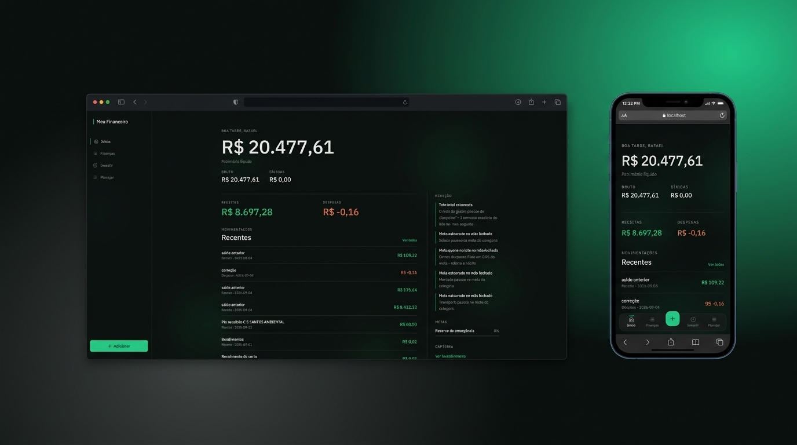

<p align="center">
   
</p>

<h1 align="center">
    <a href="https://github.com/rafael-bit/myfinance">MyFinance</a>
</h1>

<p align="center">
    MyFinance is a personal finance app to track expenses, manage budgets, and understand your money with clear insights.
</p>

<p align="center">
  <a href="https://github.com/rafael-bit/myfinance">
    
  </a>
</p>

# 🚀 How It Works

MyFinance helps you manage day-to-day money with double-entry accounting, category budgets, goals, cards, investments, and statement import. Data lives in Supabase with email/password auth; the UI is a React PWA with light and dark themes.

**Core ideas**
- Transfers between your own accounts are not income or expense
- Installments hit each month’s competency
- Card purchases leave the checking account only when the invoice is paid
- Broker deposits are not consumption expenses
- Finance math is deterministic — AI only explains numbers already computed

# 👷 Running Locally

#### Clone the repository

```bash
git clone https://github.com/rafael-bit/myfinance
cd myfinance
```

#### Install dependencies

```bash
npm install
```

#### Configure environment variables

Copy `.env.example` to `.env.local` and fill in the values:

```bash
cp .env.example .env.local
```

**Required variables**
- `VITE_SUPABASE_URL` — Supabase project URL (e.g. `https://xxxx.supabase.co`)
- `VITE_SUPABASE_PUBLISHABLE_KEY` — Supabase publishable (anon) key

#### Apply the database schema

1. Open the SQL editor in your [Supabase dashboard](https://supabase.com/dashboard)
2. Paste the contents of [`supabase/schema.sql`](./supabase/schema.sql)
3. Run the script

Optional for local development: Auth → Providers → Email → disable **Confirm email** for immediate login.

#### Run the application

```bash
npm run dev
```

Open [http://localhost:5173](http://localhost:5173) in your browser.

#### Tests and production build

```bash
npm test
npm run build
```

# 💻 Technologies

- [React](https://react.dev/)
- [TypeScript](https://www.typescriptlang.org/)
- [Vite](https://vitejs.dev/)
- [Tailwind CSS](https://tailwindcss.com/)
- [TanStack Query](https://tanstack.com/query)
- [TanStack Router](https://tanstack.com/router)
- [Supabase](https://supabase.com/)
- [Recharts](https://recharts.org/)
- [Vitest](https://vitest.dev/)
- [vite-plugin-pwa](https://vite-pwa-org.netlify.app/)

# 📁 Project structure

```
src/
  app/           # Shell, router, providers
  application/   # FinanceService, auth
  domain/        # Money, ledger, budget, import (pure logic)
  features/      # Screens (dashboard, activity, budgets, …)
  infra/         # Supabase client, market, PDF extract
  ui/            # Shared components
supabase/
  schema.sql     # Tables, RLS, signup trigger, RPCs
tests/
  domain/        # Unit tests
```

# 🚩 Bugs

Feel free to **report a new issue** with an appropriate title and description.

# 💡 Author

- Rafael Áquila ([@rafael-bit](https://github.com/rafael-bit))

# 🔧 Contributing

Check the [contribution page](https://github.com/rafael-bit/myfinance/) to see the best places to report issues, start discussions, and contribute.
